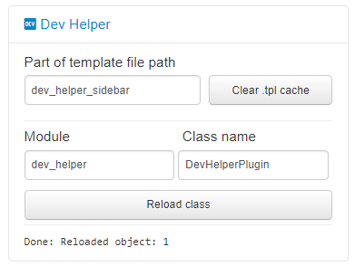

# Dev Helper

Live and instant reload of jinja templates and python source code without restarting OctoPrint.

## Motivation

During plugin development I found frustrating restarting OctoPrint after every modification.

## Setup

Install via the bundled [Plugin Manager](https://github.com/foosel/OctoPrint/wiki/Plugin:-Plugin-Manager)
or manually using this URL:

    https://github.com/jneilliii/OctoPrint-WebcamIframe/archive/master.zip

## Usage

### Reload jinja template

 - Modify the template files
 - Enter a part of the local fs path of the template file you want to reload to the `Part of template file path` field.
   (eg. `dev_helper` if you want to reload ~/.octoprint/plugins/DevHelper/templates/dev_helper_sidebar.jinja2 file.)
 - Hit `Clear cache` button.
 - It should display `Done: Cleared template cache: 1` at the bottom of the sidebar widget.
 - When reloading the page you should see effect of the modifications immediately.

### Reload python source code

 - Modify .py files
 - Enter the module (package) name of the plugin you want to reload. (eg. DevHelper)
 - Enter the class name from the module you want to update in the memory. (eg. DevHelperPlugin)
 - Hit `Reload class` button.
 - It should display `Done: Reloaded object: 1` at the bottom of the sidebar widget.
 - It will reload the module, then update the class instances function source code with the updated one.
 - **Note:** It won't `__init__` the class instances again, so it's not 100% solution, but should be fine in most cases.

### Remote eval console (disabled by default)

 - Remove the blocking exception from the eval API command
 - Reload the plugin or restart OctoPrint
 - Run command from JS console using `res = await OctoPrint.simpleApiCommand("DevHelper", "eval", {"cmd": "dir(self)"})`
